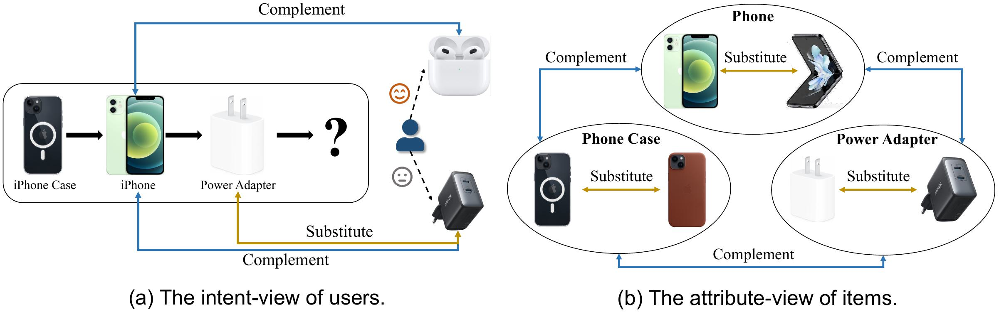
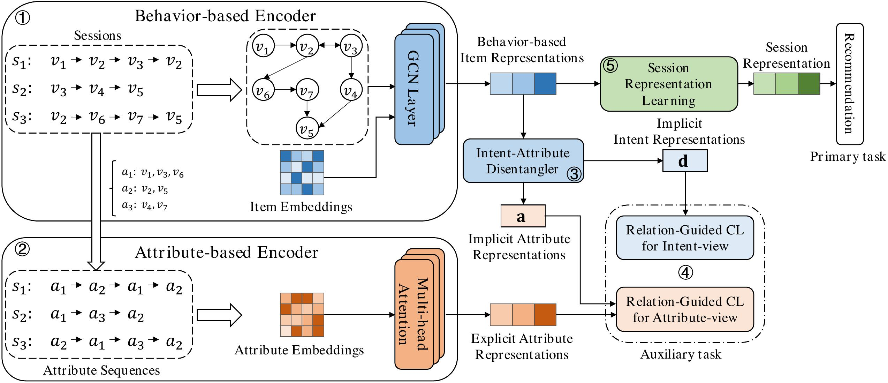
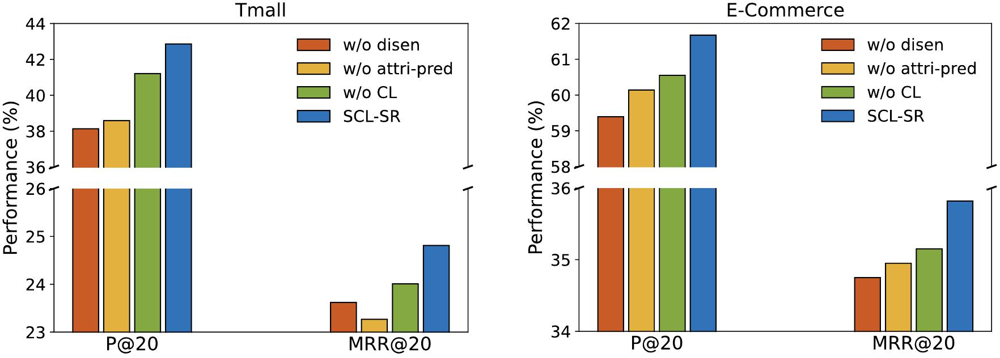
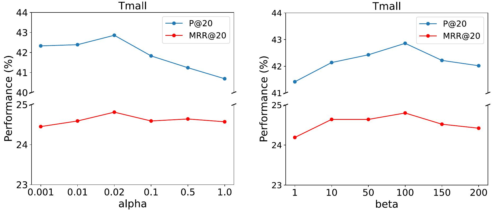
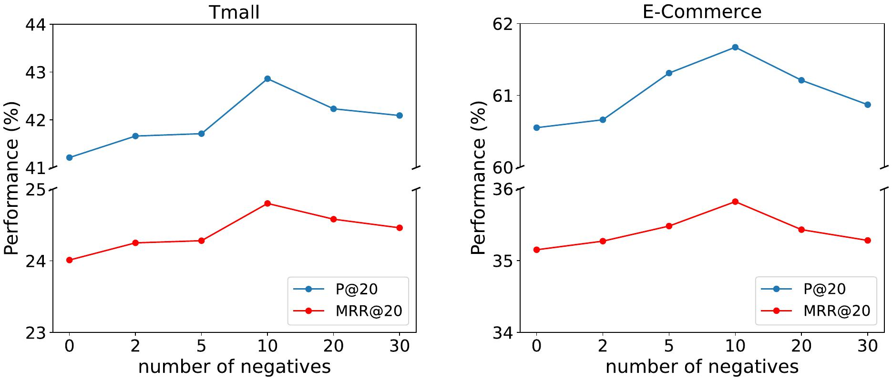
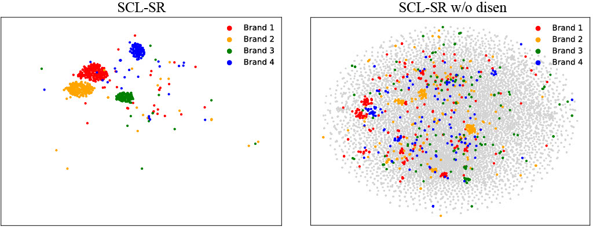

# DIREC

PyTorch implementation for the Paper: _Semantic Relation Guided Dual-view Contrastive Learning for Session-based Recommendations_.

Dual-view from the data source perspective: (user-item) intent view and (item) attribute view: In the **intent-view** of users, users tend to demand items that complement their historical sequences rather than substitutable ones. Therefore, the intent information included in complementary items should exhibit similarity, while the intent included in substitutable items should demonstrate dissimilarity. In the **attribute-view** of items, substitutable items should have similar attribute information, while attribute information included in complementary items should be dissimilar.



Figure 1. Illustration of positive and negative signals observed between substitutable and complementary items from intent and attribute views.



Figure 2. Overview of SCL-SR.

## Fold
```
├─ DIREC/ 
    ├── experiments  # Experimental results and visualizations of model performance
    ├── models/  # Code for model architectures, contrastive learning, and attention mechanisms.
        ├── attention.py/
        ...
    ├── preprocess/  # Scripts for data preprocessing and sample extraction.
    ├── utils/  # Code for dataset loading, model configuration, and training.
    main.py  # Scripts for training/testing the model on the Tmall/E-Commerce dataset.
    main_cosmetics.py  # Scripts for training/testing the model on the cosmetics dataset.
    parse.py  # Parses command-line arguments for configuring the dataset, model, training, and hyper-parameters.
```

## Requirements
- Python 3.9
- PyTorch 1.12

## Best Hyperparameter:
- Tmall: alpha=0.02, beta=100, num_coarse_sampling=90
- E-Commerce (CIKM19): alpha=0.02, beta=150, num_coarse_sampling=90
- Cosmetics: alpha=0.02, beta=100, num_coarse_sampling=90

## Datasets:
| Dataset    | URLs                                                         |
| :--------- | :----------------------------------------------------------- |
| Tmall      | https://tianchi.aliyun.com/dataset/dataDetail?dataId=42      |
| Cosmetics  | https://www.kaggle.com/datasets/mkechinov/ecommerce-events-history-in-cosmetics-shop |
| E-Commerce | https://tianchi.aliyun.com/competition/entrance/231721/information |

## Code running process:

1. **Step 1:** Data preprocessing
    ```python
    python preprocess.py --dataset Tmall
    python preprocess.py --dataset Cosmetics
    python preprocess.py --dataset CIKM19
    ```

2. **Step 2:** Negative sampling
    ```python
    python get_samples.py --dataset Tmall
    python get_samples.py --dataset Cosmetics
    python get_samples.py --dataset CIKM19
    ```

3. **Step 3:** Train & Test:
- For Tmall and E-Commerce(CIKM19):
    ```python
    python main.py --dataset Tmall --alpha 0.02 --beta 100
    python main.py --dataset CIKM19 --alpha 0.02 --beta 150
    ```
- For Cosmetics:
    ```python
    python main_cosmetics.py --dataset Cosmetics --alpha 0.02 --beta 100
    ```

## Preprocessed data:
The datasets have been preprocessed and encoded with pickle, which can be downloaded from the [link](https://pan.baidu.com/s/1eJXDmYdPiyWgEDFcoEFstg) (password: v3bj)

## Trained models:
To enhance the reproducibility of the model, we provide the trained model files in this [link](https://www.dropbox.com/scl/fo/b11lk8n1vgcf100x5sdys/AN5kai-jJVC-7nj9ATya0tg?rlkey=nr07t30cpmnmy78y7ojr6taxc&st=p1ivdbka&dl=0).

## Experiments

### 1. How do the primary components of the SCL-SR impact its recommendation performance?


Figure 3. Comparison of prediction accuracy with different variants of our model.

### 2. How do different hyper-parameter configurations, such as the weight of the contrastive loss $(\alpha)$, impact the performance of SCL-SR?

<div style="display: flex; justify-content: space-between;">
  
  
  
</div>

Figure 4. Hyper-parameter analysis and negative sample quantity analysis on different datasets.

### 3. How do item representations benefit from the intent-attribute disentangler?



Figure 5: Visualization of the learned item embeddings on Tmall dataset with and without intent-attribute disentangler.


